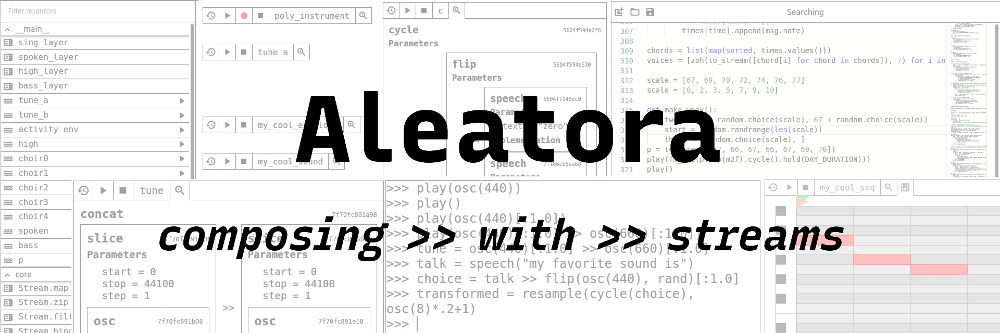

.. toctree::
   :maxdepth: 2
   :caption: Contents:

Welcome to Aleatora!
--------------------

Aleatora is a music composition framework: it is designed to help you write programs that generate organized sound (or MIDI data, OSC messages, video, or whatever other time-series data you like). To use Aleatora, you can write a program that builds up a composition, and then play the composition live, or render it to an audio file (assuming it is finite!). If the composition is deterministic, finite, and does not rely on external input, a single render may suffice to represent it. Otherwise, the composition may go on forever or change every time it is played (hence the name).

In the grand computational-musical future, there will be a platform for easily distributing such compositions without requiring the listener to install anything, but for now you can create multiple renders, play it live, or politely ask the listener to install Aleatora.

Design
------

   | "It is better to have 100 functions operate on one data structure than 10 functions on 10 data structures."
   |  --- `Alan Perlis <http://pu.inf.uni-tuebingen.de/users/klaeren/epigrams.html>`_

Aleatora is implemented as a Python library, built around lazy, effectful, replayable streams.

What does that mean? Like most audio synthesis frameworks, Aleatora lets you build up complex sounds by connecting generators in an audio graph (function composition + parallel composition). Unlike most, it also lets you build things up *horizontally*: streams can be composed sequentially, so the audio graph can *change over time* on its own (based on the computation described in the graph itself).

In other words: there are three common meanings of the word "add" in music: "add a verse", as in sequential composition; "add a harmony line", as in parallel composition; and "add some reverb", as in function composition. Aleatora supports all three of these meanings in its core abstraction, and all three can be nested interopably.

Additionally, streams may contain any kind of data type, not just samples. So you can use the same basic abstraction, and all the operations that it offers, to work with individual samples, multichannel frames, strings, events, arrays, MIDI data, etc., just as well as with individual audio samples.

Finally, streams are first-class values. You can store them in variables, pass them around, write functions that transform them, and so on. This allows you to build up compositions functionally. Rather than saying, "it's time T, so make change X to the audio graph! then make change Y! then make change Z!", you can say "my composition consists of stream A, sliced at time T, followed by stream B". In this simple case, the distinction may seem trivial, but the latter also allows you to express things that would be difficult or impossible without compositions-as-values; for example, you can say "my composition consists of stream A, but `wobbled`" (run at a time-varying rate, `without` being rendered to a buffer ahead of time).

Features
--------

- Built around streams: build up compositions using sequential, parallel, and functional composition.
- Easily work at different levels of abstraction, from individual audio samples to events and beyond.
- Language integration:

  - Streams are iterables, and iterables can be easily converted to streams.
  - Operator overloading to make working with streams more pleasant and concise.
  - Aleatora is a library, not a new language: benefit from the verdant Python ecosystem.

- Basic file format support: load from and save to WAV and MIDI.
- Multichannel support:

  - Streams may yield frames containing multiple samples (one per channel).
  - Operator overloading to allow mixing with mono streams or multichannel streams of the same size.

- Support for arbitrary mixing of sample rates.
- Networking integration: use TCP, UDP, OSC streams in your composition.
- (Optional) Quickly express musical ideas using `FoxDot <https://foxdot.org/docs/pattern-basics/>`_ patterns and strings.
- (Optional) TTS support via `Festival <http://festvox.org/festival/>`_ and `gTTS <https://pypi.org/project/gTTS/>`_.
- (Optional, Experimental) Support for plugins via `popsicle <https://github.com/kunitoki/popsicle>`_: load and run VST, AU, LADSPA plugins.
  
Getting Started
------------

Installation
############

.. code-block:: bash

   virtualenv venv -p pypy3  # or python3, if you're okay with more underruns
   source venv/bin/activate
   pip install aleatora  # for optional features, append a bracketed list like [speech,foxdot] or [all]

To ensure installation succeeded and that you can get sound out, try playing a sine tone:

>>> from aleatora import *
>>> play(osc(440))

Tutorial
########

**Coming soon!** In the meantime, check out `this quick demo <https://www.youtube.com/watch?v=F2V-n4nsLgM&t=216s>`_ recorded for Audio Mostly '21.

Status
------

Aleatora is early-stage software. There is some documentation (see the :ref:`modindex`), but the docs (like the project itself) are still a work in progress. Please try Aleatora, submit issues when you find broken things (or have questions, feature requests, etc.), but don't rely on it for live production systems or installations.

Changes from version 0.1.0
--------------------------

The most significant change between Aleatora 0.1.0 and 0.2.0 is in the conception and implementation of streams. Aleatora 0.1.0 implemented streams in the sense of `SRFI-41 <https://srfi.schemers.org/srfi-41/srfi-41.html>`_: a lazy, recursive data structure. A stream was a function (with no arguments - a `thunk <https://en.wikipedia.org/wiki/Thunk>`_) that returned either a tuple ``(value: Any, rest_of_stream: Stream)`` or an instance of ``Return(value: any)`` indicating the end of the stream.

This formulation is elegant, and can potentially allow replayability from any point: as long as you retain a reference to a given point in the stream, you can replay the rest of the stream from that point. (And since Aleatora's streams are intentionally unmemoized, it may take a different path and re-run side effects.)

However, this implementation had three significant drawbacks:

- Considerable overhead; regenerated the entire "stream graph" for every single computed value, even if the user didn't need to save state for later replay, and added layers of indirection while traversing streams.
- Required users to write in an unwieldy style heavily featuring closures and deferred recursion in order to define new "raw" streams. (Relatedly, entailed strange distinction between raw and compound streams.)
- Tricky semantic and performance questions about saving state: if a stream uses a mutable structure in its computation, such as a buffer for a delay effect, should that get saved? (Prohibitively expensive if it's always saved; unexpected behavior if it's not; no good interface for the user to specify what to save without opening the black box.)

Aleatora 0.2.0 has moved to a new implementation of streams. Streams are still lazy sequences of values, but they are now Python iterables: a stream produces an iterator which is used to force subsequent values, but, unlike before, the iterator state may not necessarily be copyable. This sheds the semi-supported feature of replayability from an arbitrary point, but it preserves replayability from the `beginning` of streams and avoids the drawbacks mentioned above. Raw streams are now much easier to read and write, as generator functions can be easily made into streams, allowing the use of Python's ``yield`` and ``yield from``. In short, this change improves performance and integration with the host language, at the expense of a niche and poorly-defined feature.

For example, here's how this affected the implementation of the core method ``Stream.filter()``:

+--------------------------------------------------------+--------------------------------+
|                                                        |                                |
|.. code-block::                                         |.. code-block::                 |
|                                                        |                                |
|  # Before: Aleatora 0.1.0                              |  # After: Aleatora 0.2.0       |
|  @raw_stream                                           |  @stream                       |
|  def filter(self, predicate):                          |  def filter(self, predicate):  |
|      def closure():                                    |      for x in self:            |
|          stream = self                                 |         if predicate(x):       |
|          while True:                                   |               yield x          |
|              result = stream()                         |                                |
|              if isinstance(result, Return):            |                                |
|                  return result                         |                                |
|              value, stream = result                    |                                |
|              if not predicate(value):                  |                                |
|                  continue                              |                                |
|              return (value, stream.filter(predicate))  |                                |
|      return closure                                    |                                |
|                                                        |                                |
+-------------------------+------------------------------+--------------------------------+

Indices and tables
==================

* :ref:`genindex`
* :ref:`modindex`
* :ref:`search`
